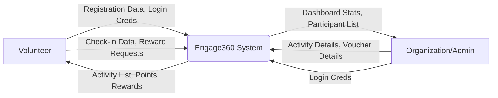
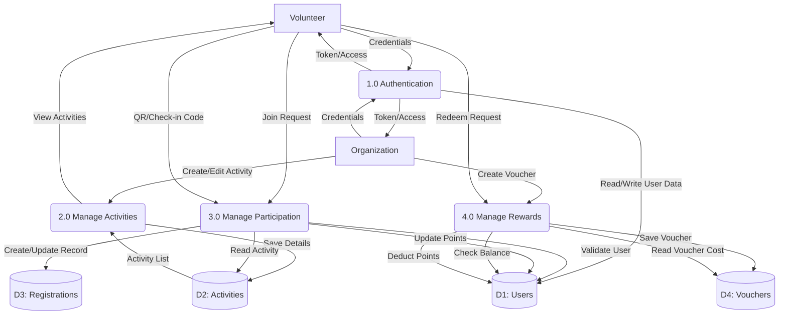

# Engage360 - Data Flow Diagrams (DFD)

## Level 0 DFD (Context Diagram)
High-level overview of the system and its external entities.

## Level 1 DFD (System Breakdown)
Detailed breakdown of major processes and data stores.

### Data Dictionary
- **Users**: `uid`, `name`, `email`, `role`, `points`, `lifetimePoints`.
- **Activities**: `id`, `title`, `description`, `location`, `startDate`, `participants`.
- **Registrations**: `id`, `userId`, `activityId`, `status`, `timestamp`.
- **Vouchers**: `id`, `title`, `cost`, `imageUrl`, `createdBy`.
