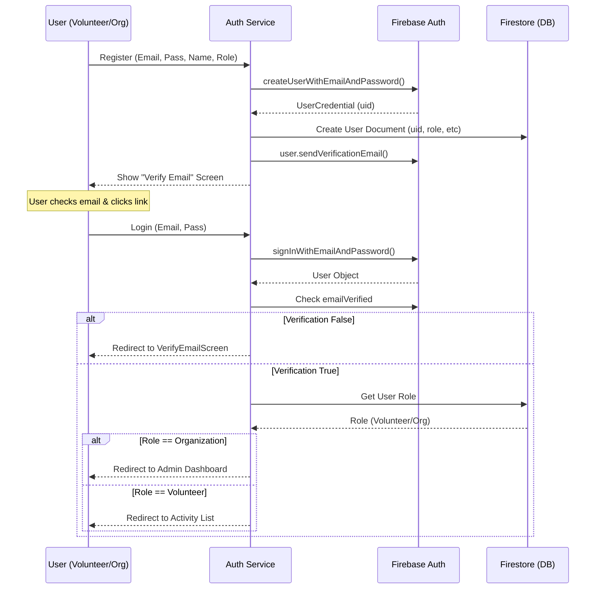
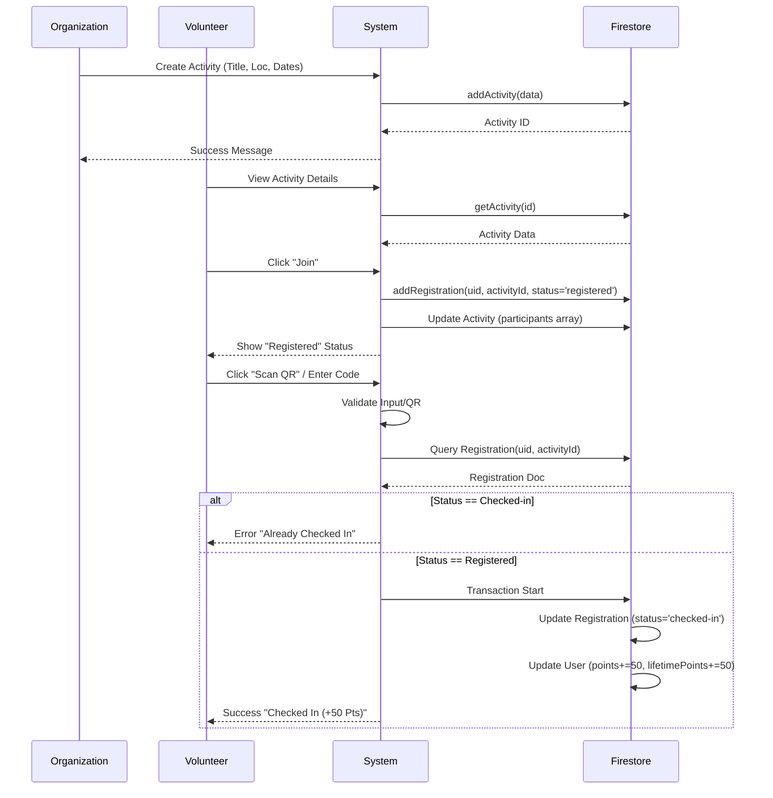
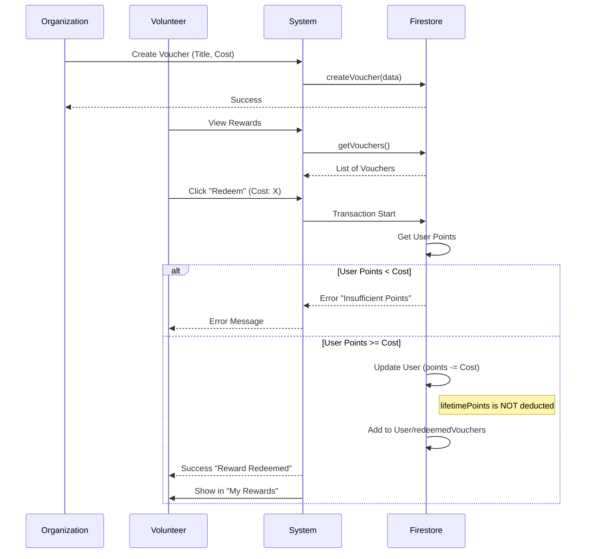

# Engage360 - System Sequence Diagrams

These diagrams illustrate the interaction between actors (Volunteers, Organizations) and the System (App + Firebase Backend).

## 1. Authentication & Verification
This flow covers Registration, Email Verification, and Login.

## 2. Activity Lifecycle (Create -> Join -> Check-in)
This flow shows how an activity is created, joined, and how users check in to earn points.

## 3. Rewards & Redemption
This flow shows how vouchers are created and redeemed.

